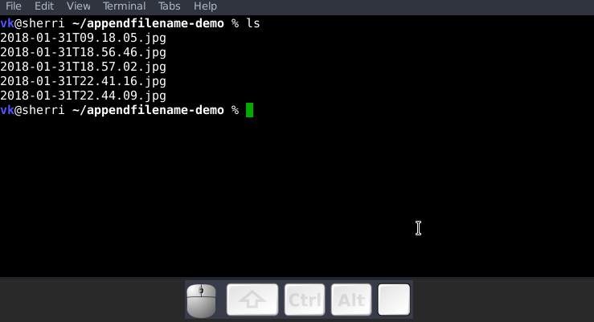

#+OPTIONS: TOC:nil
#+OPTIONS: ^:nil

* appendfilename.py

#+BEGIN_HTML

#+END_HTML

This Python script adds a string to a file name. The string gets added
between the original file name and its extension.

In case the file name contains tags as handled as with [[https://github.com/novoid/filetag][filetag]], the
string gets added right before the separator between file name and
tags.

Examples for adding the string "new text":

| *old file name*                        | *new file name*                                 |
|----------------------------------------+-------------------------------------------------|
| a simple file.txt                      | a simple file new text.txt                      |
| a simple file -- foo bar.txt           | a simple file new text -- foo bar.txt           |
| 2013-05-09.jpeg                        | 2013-05-09 new text.jpeg                        |
| 2013-05-09T16.17.jpeg                  | 2013-05-09T16.17 new text.jpeg                  |
| 2013-05-09T16.17_img_00042.jpeg        | 2013-05-09T16.17_img_00042 new text.jpeg        |
| 2013-05-09T16.17_img_00042 -- fun.jpeg | 2013-05-09T16.17_img_00042 new text -- fun.jpeg |

- *Target group*: users who are able to use command line tools and who
  are using tags in file names.
- Hosted on github: https://github.com/novoid/appendfilename

** Why

Besides the fact that I am using [[https://en.wikipedia.org/wiki/Iso_date][ISO dates and times]] in file names (as
shown in examples above), I am using tags with file names. To separate
tags from the file name, I am using the four separator characters:
space dash dash space.

For people familiar with [[https://en.wikipedia.org/wiki/Regex][Regular Expressions]]:

: (<ISO date/time stamp>)? <descriptive file name> -- <list of tags separated by spaces>.extension

For tagging, please refer to [[https://github.com/novoid/filetag][filetag]] and its documentation.

If I want to add a descriptive file name to files like , e.g. ,
photographs, I have to rename the original file and insert the
description at the right spot of the existing file name.

This is an error-prone task. If I am not careful, I can overwrite
parts of the old file name I wanted to keep. Or I could mess up
spacing between the old file name, tags, and the new description.

Therefore, I wrote this script that adds a description to the file
name without removing old file name parts or tags.

You may like to add this tool to your image or file manager of
choice. I added mine to [[http://geeqie.sourceforge.net/][geeqie]] which is my favorite image viewer on
GNU/Linux.

** Usage

: appendfilename --text foo a_file_name.txt
... adds "foo" such that it results in ~a_file_name foo.txt~

: appendfilename a_file_name.txt
... (implicit) interactive mode: asking for the string to add from the user

: appendfilename --text "foo bar" "file name 1.jpg" "file name 2 -- foo.txt" "file name 3 -- bar.csv"
... adds tag "foo" such that it results in ...
: "file name 1 foo bar.jpg"
: "file name 2 foo bar -- foo.txt"
: "file name 3 foo bar -- bar.csv"

For a complete list of parameters, please try:
: appendfilename --help

The file names within the current working directory is read in and all
found words can be completed via TAB.

-----------------------

#+BEGIN_SRC sh :results output :wrap src
./appendfilename/__init__.py --help
#+END_SRC

#+BEGIN_src
Usage:
    appendfilename [<options>] <list of files>

This tool inserts text between the old file name and optional tags or file extension.

Text within file names is placed between the actual file name and
the file extension or (if found) between the actual file namd and
a set of tags separated with " -- ".
  Update for the Boss  <NEW TEXT HERE>.pptx
  2013-05-16T15.31.42 Error message <NEW TEXT HERE> -- screenshot projectB.png

When renaming a symbolic link whose source file has a matching file
name, the source file gets renamed as well.

Example usages:
  appendfilename --text="of projectA" "the presentation.pptx"
      ... results in "the presentation of projectA.pptx"
  appendfilename "2013-05-09T16.17_img_00042 -- fun.jpeg"
      ... with interactive input of "Peter" results in:
          "2013-05-09T16.17_img_00042 Peter -- fun.jpeg"

:copyright: (c) 2013 or later by Karl Voit <tools@Karl-Voit.at>
:license: GPL v3 or any later version
:URL: https://github.com/novoid/appendfilename
:bugreports: via github or <tools@Karl-Voit.at>
:version: 2019-10-19

Options:
  -h, --help            show this help message and exit
  -t TEXT, --text=TEXT  the text to add to the file name
  -p, --prepend         Do the opposite: instead of appending the text,
                        prepend the text
  --smart-prepend       Like "--prepend" but do respect date/time-stamps:
                        insert new text between "YYYY-MM-DD(Thh.mm(.ss))" and
                        rest
  -s, --dryrun          enable dryrun mode: just simulate what would happen,
                        do not modify file(s)
  -v, --verbose         enable verbose mode
  -q, --quiet           enable quiet mode
  --version             display version and exit
#+END_src

** Installation

Get it from [[https://pypi.org/project/appendfilename/\\][PyPI]] by the command ~pip install appendfilename~.  If you
clone or fetch it from [[https://github.com/novoid/appendfilename][GitHub]], enter the folder of your copy and
resolve the dependencies defined in ~pyproject.toml~ by either

#+begin_src sh
  pip install .
  pip install .[dev]
#+end_src

for use, or development.  In the later case, don't forget the
optional ~-e~ flag to render the installation editable.

** Smart Prepend

Although =appendfilename= was created mainly to /add text at the end
of a file name/, it may also insert text at the beginning of a file
name using the =--prepend= parameter.

A variance of that is =--smart-prepend=. Following examples
demonstrate the effects on smart prepending "new text" with various
file names:

: new text foo bar.txt
: 2019-10-20 new text foo bar.txt
: 2019-10-20T12.34 new text foo bar.txt
: 2019-10-20T12.34.56 new text foo bar.txt

As you can see, =--smart-prepend= does take into account that a given
date/time-stamp according to [[https://github.com/novoid/date2name][date2name]] and [[https://karl-voit.at/managing-digital-photographs/][this article]] will always
stay the first part of a file name, prepending the "new text" between
the date/time-stamp and the rest.

* Integration Into Common Tools

** Integration into Windows File Explorer

The easiest way to integrate =appendfilename= into File Explorer
("Send to" context menu) is by using [[https://github.com/novoid/integratethis][integratethis]].

Execute this in your command line environment:

: pip install appendfilename integratethis
: integratethis appendfilename --confirm

*** Windows File Explorer for single files (manual method)

Use this only if the [[https://github.com/novoid/integratethis][integratethis]] method can not be applied:

Create a registry file =add_appendfilename_to_context_menu.reg= and edit it
to meet the following template. Please make sure to replace the paths
(python, =USERNAME= and =appendfilename=) accordingly:

#+BEGIN_EXAMPLE
Windows Registry Editor Version 5.00

;; for files:

[HKEY_CLASSES_ROOT\*\shell\appendfilename]
@="appendfilename (single file)"

[HKEY_CLASSES_ROOT\*\shell\appendfilename\command]
@="C:\\Python36\\python.exe C:\\Users\\USERNAME\\src\\appendfilename\\appendfilename\\__init__.py -i \"%1\""
#+END_EXAMPLE

Execute the reg-file, confirm the warnings (you are modifying your
Windows registry after all) and cheer up when you notice "appendfilename
(single file)" in the context menu of your Windows Explorer.

As the heading and the link name suggests: [[https://stackoverflow.com/questions/6440715/how-to-pass-multiple-filenames-to-a-context-menu-shell-command][this method works on single
files]]. So if you select three files and invoke this context menu item,
you will get three different filetag-windows to tag one file each.

*** Windows File Explorer for single and multiple selected files (manual method)

Use this only if the [[https://github.com/novoid/integratethis][integratethis]] method can not be applied:

Create a batch file in your home directory. Adapt the paths to meet
your setup. The content looks like:

: C:\Python36\python.exe C:\Users\USERNAME\src\appendfilename\appendfilename\__init__.py -i %*

If you want to confirm the process (and see error messages and so
forth), you might want to append as well following line:

: set /p DUMMY=Hit ENTER to continue ...

My batch file is located in =C:\Users\USERNAME\bin\appendfilename.bat=. Now
create a lnk file for it (e.g., via Ctrl-Shift-drag), rename the lnk
file to =appendfilename.lnk= and move the lnk file to
=~/AppData/Roaming/Microsoft/Windows/SendTo/=.

This way, you get a nice entry in your context menu sub-menu "Send to"
which is also correctly tagging selection of files as if you put the
list of selected items to a single call of appendfilename.

** Integrating into Geeqie

I am using [[http://geeqie.sourceforge.net/][geeqie]] for browsing/presenting image files. After I
mark a set of images for adding file name descriptions, I just have to
press ~a~ and I get asked for the input string. After entering the string and
RETURN, the filenames are modified accordingly.

Using GNU/Linux, this is quite easy accomplished. The only thing that
is not straight forward is the need for a wrapper script. The wrapper
script does provide a shell window for entering the tags.

~vk-appendfilename-interactive-wrapper-with-gnome-terminal.sh~ looks like:

#+BEGIN_SRC sh
#!/bin/sh

/usr/bin/gnome-terminal \
    --geometry=73x5+330+5  \
    --hide-menubar \
    -x /home/vk/src/appendfilename/appendfilename/__init__.py "${@}"

#end
#+END_SRC

In ~$HOME/.config/geeqie/applications~ I wrote two desktop files such
that geeqie shows the wrapper scripts as external editors to its
image files:

~$HOME/.config/geeqie/applications/add-tags.desktop~ looks like:
: [Desktop Entry]
: Name=appendfilename
: GenericName=appendfilename
: Comment=
: Exec=/home/vk/src/misc/vk-appendfilename-interactive-wrapper-with-gnome-terminal.sh %F
: Icon=
: Terminal=true
: Type=Application
: Categories=Application;Graphics;
: hidden=false
: MimeType=image/*;video/*;image/mpo;image/thm
: Categories=X-Geeqie;

In order to be able to use the keyboard shortcuts ~a~, you can define them in geeqie:
1. Edit > Preferences > Preferences ... > Keyboard.
2. Scroll to the bottom of the list.
3. Double click in the ~KEY~-column of ~appendfilename~
   and choose your desired keyboard shortcut accordingly.

I hope this method is as handy for you as it is for me :-)

** Integration into Thunar

[[https://en.wikipedia.org/wiki/Thunar][Thunar]] is a popular GNU/Linux file browser for the xfce environment.

Unfortunately, it is rather complicated to add custom commands to
Thunar. I found [[https://askubuntu.com/questions/403922/keyboard-shortcut-for-thunar-custom-actions][a good description]] which you might want to follow.

To my disappoinment, even this manual confguration is not stable
somehow. From time to time, the IDs of ~$HOME/.config/Thunar/uca.xml~
and ~$HOME/.config/Thunar/accels.scm~ differ.

For people using Org-mode, I automated the updating process (not the
initial adding process) to match IDs again:

Script for checking "tag": do it ~tag-ID~ and path in ~accels.scm~ match?
: #+BEGIN_SRC sh :var myname="tag"
: ID=`egrep -A 2 "<name>$myname" $HOME/.config/Thunar/uca.xml | grep unique-id | sed 's#.*<unique-id>##' | sed 's#<.*$##'`
: echo "$myname-ID of uca.xml: $ID"
: echo "In accels.scm: "`grep -i "$ID" $HOME/.config/Thunar/accels.scm`
: #+END_SRC

If they don't match, following script re-writes ~accels.scm~ with the current ID:
: #+BEGIN_SRC sh :var myname="tag" :var myshortcut="<Alt>t"
: ID=`egrep -A 2 "<name>$myname" $HOME/.config/Thunar/uca.xml | grep unique-id | sed 's#.*<unique-id>##' | sed 's#<.*$##'`
: echo "appending $myname-ID of uca.xml to accels.scm: $ID"
: mv $HOME/.config/Thunar/accels.scm $HOME/.config/Thunar/accels.scm.OLD
: grep -v "\"$myshortcut\"" $HOME/.config/Thunar/accels.scm.OLD > $HOME/.config/Thunar/accels.scm
: rm $HOME/.config/Thunar/accels.scm.OLD
: echo "(gtk_accel_path \"<Actions>/ThunarActions/uca-action-$ID\" \"$myshortcut\")" >> $HOME/.config/Thunar/accels.scm
: #+END_SRC

** Integration into FreeCommander

[[http://freecommander.com/en/summary/][FreeCommander]] is a [[https://en.wikipedia.org/wiki/File_manager#Orthodox_file_managers][orthodox file manager]] for Windows. You can add
appendfilename as an favorite command:

- Tools → Favorite tools → Favorite tools edit... (S-C-y)
  - Create new toolbar (if none is present)
  - Icon for "Add new item"
    - Name: appendfilename
    - Program or folder: <Path to appendfilename.bar>
	- =appendfilename.bat= looks like: (please do modify the paths to meet your requirement)
        : C:\Python36\python.exe C:\Users\YOURUSERNAME\src\appendfilename\appendfilename\__init__.py %*
	  : REM optionally: set /p DUMMY=Hit ENTER to continue...
    - Start folder: =%ActivDir%=
    - Parameter: =%ActivSel%=
    - [X] Enclose each selected item with ="=
    - Hotkey: select next available one such as =Ctrl-1= (it gets overwritten below)
	- remember its name such as "Favorite tool 01"
  - OK

So far, we've got =appendfilename= added as a favorite command which can be
accessed via menu or icon toolbar and the selected keyboard shortcut.
If you want to assign a different keyboard shortcut than =Ctrl-1= like
=Alt-a= you might as well follow following procedure:

- Tools → Define keyboard shortcuts...
  - Scroll down to the last section "Favorite tools"
  - locate the name such as "Favorite tool 01"
  - Define your shortcut of choice like =Alt-a= in the right hand side of the window
    - If your shortcut is taken, you'll get a notification. Don't
      overwrite essential shortcuts you're using.
  - OK

* Related tools and workflows
# --- BEGIN SHARED: filetags_tools --- see https://github.com/novoid/screencasts/

This tool is part of a tool-set which I use to manage my digital files
such as photographs. My work-flows are described in [[http://karl-voit.at/managing-digital-photographs/][this blog posting]]
you might like to read and in the video which is linked above.

In short:

- For *tagging*, please refer to [[https://github.com/novoid/filetags][filetags]] and its documentation. It's
  the most important part of the whole concept on how I manage files.

- See [[https://github.com/novoid/date2name][date2name]] for easily adding ISO *time-stamps or date-stamps* to files.

- For *easily naming and tagging* files within file browsers that
  allow integration of external tools, see [[https://github.com/novoid/appendfilename][appendfilename]] (once more)
  and [[https://github.com/novoid/filetags][filetags]].

- Moving to the archive folders is done using [[https://github.com/novoid/move2archive][move2archive]].

- Having tagged photographs gives you many advantages. For example, I
  automatically [[https://github.com/novoid/set_desktop_background_according_to_season][choose my *desktop background image* according to the
  current season]].

- Files containing an ISO time/date-stamp gets indexed by the
  filename-module of [[https://github.com/novoid/Memacs][Memacs]].

-----------

- Alternative implementations of the =filetags= concept:
  - [[https://github.com/beutelma/filetags.el][GitHub - DerBeutlin/filetags.el: Emacs package to manage filetags in the filename]]
  - With [[https://github.com/protesilaos/denote][denote]], Protesilaos
    Stavrou implemented a conceptually related approach to manage notes
    within an Emacs buffer.  With ~dired~, this method equally may be
    applied on files, too.

- A research platform for testing file-tagging on all platforms: [[https://karl-voit.at/tagstore/][tagstore]]
  - This happens to be an important part of [[https://karl-voit.at/tagstore/downloads/Voit2012b.pdf][my PhD thesis]] in PIM.
  - Not maintained since 2013 any more but surely still a cool
    starting point in case you want to get a flexible tool when doing
    research with tagging interfaces.

- Good resources for tagging software in general
  - [[https://turbofuture.com/computers/Whats-the-Best-Software-for-Tagging-Files-A-Review][What's the Best Software for Tagging Files? | TurboFuture]]
  - "Marktübersicht von Tagging-Werkzeugen und Vergleich mit tagstore" (German, 2013): linked on [[https://karl-voit.at/tagstore/en/papers.shtml][this page]] of the [[https://karl-voit.at/tagstore/][tagstore project]]

- If you do like filetags but you prefer the syntax of [[https://www.tagspaces.org/][TagSpaces]] for
  adding tags to file names, you should check out [[https://github.com/jgru/filetags][this filetags fork]].
  Maintenance is limited though. Please notice that my other tools
  working with tags do not support TagSpaces-style either.

- https://forge.chapril.org/tykayn/rangement.git
  - An NPM implementation of a subset of GuessFileName (using image exif header), append2name, move2archive
  - You probably need to read a bit of French

- Similar projects to =m2a=:
  - https://github.com/velvet-jones/imgfiler/
# --- END SHARED: filetags_tools --- see https://github.com/novoid/screencasts/

* How to Thank Me
# --- BEGIN SHARED: how_to_thank_me --- see https://github.com/novoid/screencasts/

I'm glad if you like my tool. I've got way more projects on:

- [[https://github.com/novoid/][GitHub]] (oldest projects),
- [[https://gitlab.com/publicvoit/][GitLab.com]] (older projects), and
- [[https://codeberg.org/publicvoit/][Codeberg]] (newest projects).

If you want to support me:

- [[https://karl-voit.at/2018/06/07/cardware/][Send old-fashioned *postcard* per snailmail]] - I love personal feedback!
  - see [[http://tinyurl.com/j6w8hyo][my address]]
- Send feature wishes or improvements as an issue 
- Create issues for bugs
- Contribute merge requests for bug fixes
- Check out my other cool projects on the platforms above

If you want to contribute to this cool project, please fork and
contribute!

I am using [[http://www.python.org/dev/peps/pep-0008/][Python PEP8]] and occasionally some ideas from [[http://en.wikipedia.org/wiki/Test-driven_development][Test Driven
Development (TDD)]]. I fancy Python3 with [[https://typing.python.org/en/latest/spec/annotations.html][type annotations]], although I'm
not using them everywhere at the moment. Starting with 2025, I began
to use help from Claude.ai which is a huge improvement, given my lack
of programming practice and knowledge.

After all, each of my tools was developed because I needed its
functionality and could not get it elsewhere - at least to my
knowledge or taste.

# --- END SHARED: how_to_thank_me --- see https://github.com/novoid/screencasts/

